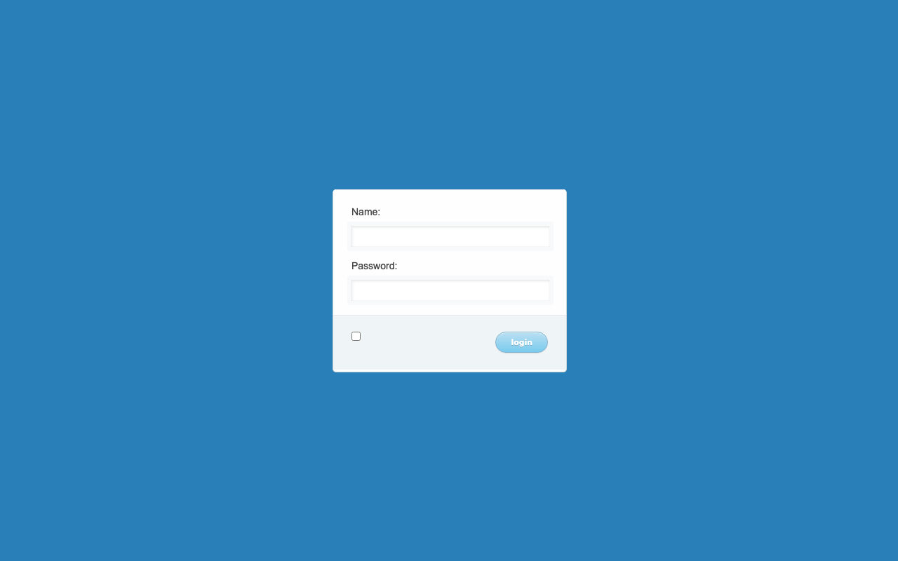
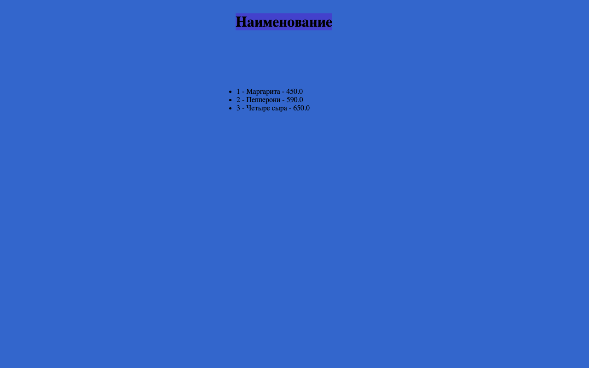

# SpringMVC

Учебное Java-приложение для работы со списком пицц. Проект показывает классическую связку Spring MVC, JSP и Hibernate: контроллер принимает HTTP-запрос, DAO обращается к MySQL, а JSP отображает результат.

Приложение собирается в WAR и запускается в servlet-контейнере. Spring Boot и встроенного сервера в репозитории нет.

## Интерфейс

### Страница входа

Синий фон, белая форма по центру, поля `Name` и `Password`, чекбокс и кнопка `login`.



Снимок страницы `/` локально запущенного приложения. Чекбокс в исходном шаблоне не имеет подписи.

### Список пицц

После отправки формы контроллер загружает пиццы из базы и выводит их в формате `id — название — цена` под заголовком «Наименование».



Снимок исходного шаблона `hello.jsp`, отрисованного локально с демонстрационными данными: «Маргарита», «Пепперони» и «Четыре сыра». Это предпросмотр оформления, а не данные рабочей MySQL: при подготовке документации подключение к внешней базе было недоступно. Временная страница предпросмотра не входит в приложение.

В проекте также есть `home.jsp`: форма с полями `Id`, `Name`, `Price`, кнопками `Add`, `Edit`, `Delete`, `Search` и таблицей. Этот экран не подключён к обычной навигации и требует исправления передачи атрибутов модели (см. ограничения ниже).

## Возможности и маршруты

| Запрос | Назначение |
| --- | --- |
| `GET /` | Отображает `login.jsp` с моделью пользователя. |
| `POST /check-user` | Читает все пиццы через `PizzaDAO.findAll()` и отображает `hello.jsp`. |
| `POST /pizza.do` | Выбирает добавление, изменение, удаление или поиск по параметру `action`; возвращает `home.jsp`. |
| `GET /resources/**` | Отдаёт статические ресурсы, включая CSS. |

Модель `Pizza` содержит `id`, `name` и `price` и связана с таблицей `pizza`. Операции DAO выполняются в транзакциях Hibernate.

## Технологии

Версии указаны по `pom.xml`:

- Java 7 — исходные настройки `source` и `target`.
- Spring Framework / Spring MVC 4.1.1.RELEASE.
- Hibernate 4.2.2.Final и Apache Commons DBCP 1.4.
- MySQL Connector/J 5.1.25.
- JSP, JSTL 1.2 и Servlet API `javax.servlet`.
- Maven, JUnit 4.11 и Spring Test.

## Локальный запуск

### 1. Подготовьте окружение

Для исходной конфигурации сборки используйте JDK 8, Maven 3 и servlet-контейнер с поддержкой `javax.servlet` и JSP, например Tomcat 9. Проверьте, что `JAVA_HOME` и `mvn -version` указывают на выбранный JDK.

Исходный `pom.xml` задаёт Java 7; на JDK 21 такая компиляция не поддерживается. Tomcat 10+ использует другое пространство имён (`jakarta.servlet`) и требует миграции приложения.

### 2. Настройте MySQL

В [mvc-dispatcher-servlet.xml](src/main/webapp/WEB-INF/mvc-dispatcher-servlet.xml) замените параметры бина `myDataSource`: `url`, `username` и `password` на реквизиты своей базы. Не публикуйте действующие пароли в Git.

Создайте таблицу в выбранной базе: автоматическое создание схемы в конфигурации Hibernate не включено.

```sql
CREATE TABLE pizza (
    id BIGINT NOT NULL AUTO_INCREMENT PRIMARY KEY,
    name VARCHAR(255),
    price DOUBLE NOT NULL
);

-- Необязательные демонстрационные данные.
INSERT INTO pizza (name, price) VALUES
    ('Маргарита', 450),
    ('Пепперони', 590),
    ('Четыре сыра', 650);
```

Для кириллицы используйте базу с кодировкой UTF-8 и соответствующие параметры JDBC-подключения.

### 3. Соберите и разверните WAR

```sh
mvn -Dmaven.test.skip=true package
```

Скопируйте `target/SpringMVC.war` в каталог `webapps` своего Tomcat и запустите сервер. При стандартном HTTP-порте 8080 страница входа будет доступна по адресу:

```text
http://localhost:8080/SpringMVC/
```

Контекст зависит от развёртывания: если приложение размещено в корневом контексте, адрес будет `http://localhost:8080/`.

Тесты в команде сборки пропущены намеренно: существующий `AppTests.simple()` ожидает представление `hello`, хотя текущий `GET /` возвращает `login`. Тест также загружает Spring-контекст с настройками базы данных. Перед использованием тестов как проверки сборки нужно обновить ожидание и подготовить тестовую БД.

Это инструкция для исходного стека. Скриншоты получены при отдельном локальном запуске на Java 21 и Jetty с временной конфигурацией совместимости; эта конфигурация не входит в репозиторий, и исходная сборка на JDK 8 в рамках подготовки README не проверялась.

## Структура проекта

```text
src/main/java/com/springapp/mvc/
├── HelloController.java       # HTTP-маршруты и передача данных в представления
├── DAO/                       # Интерфейс и реализация доступа к пиццам
└── model/                     # Pizza и User
src/main/webapp/
├── WEB-INF/
│   ├── web.xml                # DispatcherServlet и фильтр UTF-8
│   ├── mvc-dispatcher-servlet.xml  # Spring, MySQL, Hibernate и транзакции
│   └── pages/                 # login.jsp, hello.jsp, home.jsp
└── resources/css/             # Стили входа и списка пицц
src/test/java/                 # Тест Spring MVC
```

## Ограничения текущей реализации

- Форма входа не выполняет аутентификацию: `/check-user` сразу читает список пицц. Поле пароля — обычный текстовый input, поэтому символы не скрываются.
- Флаг `admin` не управляет доступом; сеттер `User.setAdmin()` не присваивает значение полю объекта.
- Для `home.jsp` имена атрибутов не согласованы: форма ожидает `Pizza`, контроллер передаёт `pizza`; таблица ожидает `pizzas`, контроллер передаёт `pizzaList`. Поэтому наличие CRUD-методов в DAO не означает, что экран управления работает целиком.
- Внешняя MySQL из исходной конфигурации была недоступна при проверке. Страница входа открывалась, но операции с данными требуют рабочего подключения.

Проект подходит для изучения устройства Spring MVC-приложения; полноценные авторизация, валидация и обработка ошибок здесь ещё не реализованы.
